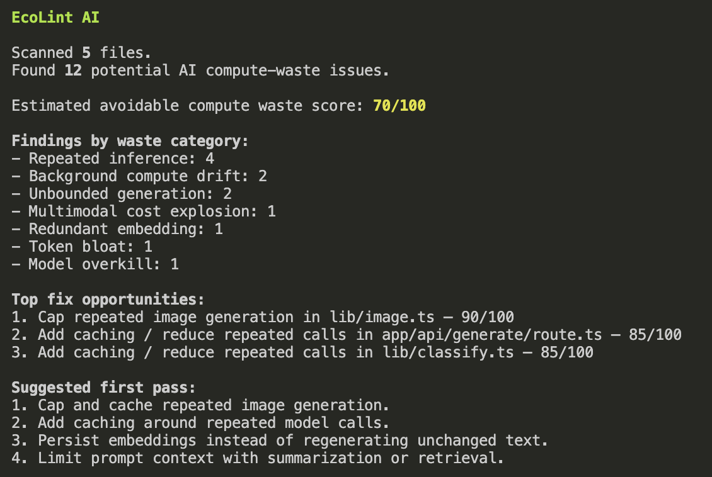

# EcoLint AI

**ESLint for wasteful AI compute.**


EcoLint AI is a **static analysis tool for AI app efficiency**. It catches
patterns like uncached LLM calls, token bloat, repeated embeddings, model
overkill, and missing token limits before they become API bills, latency, or
unnecessary compute demand.

It runs entirely on your source code:

- **Static analysis** — regex/heuristic scanning of your codebase.
- **No API keys** and **no network calls** — nothing leaves your machine.
- **No exact emissions or water measurement** — only directional estimates.
- Helps you **find avoidable AI compute waste before shipping**.

The primary win is practical: **cost, latency, reliability, and code review**.
Environmental impact is a secondary, directional signal — see
[Limitations](#limitations).

> **EcoLint AI uses static heuristics and directional impact estimates. It does
> not measure exact emissions, water usage, or infrastructure-level energy
> consumption.**

> **Trying it right now?** Jump to the [20-second demo](#20-second-demo) or see
> [DEMO.md](DEMO.md) for a longer walkthrough.

---

## 20-second demo

```bash
mkdir ecolint-demo && cd ecolint-demo
cat > bad.ts <<'EOF'
import OpenAI from "openai";

const openai = new OpenAI();

export async function classify(text: string) {
  return openai.chat.completions.create({
    model: "gpt-4o",
    messages: [{ role: "user", content: `classify this: ${text}` }]
  });
}
EOF

npx ecolint-ai scan --path .
```

You'll get a prioritized report: an uncached LLM call, a top-tier model on a
classification task, and a missing output token limit — each with a fix recipe.

---

## Example output

Running EcoLint AI on the intentionally wasteful example app:

```bash
npm run scan:example
```



---

## What it does

EcoLint AI answers one question a developer has right before shipping an AI
feature:

> "Before I ship this AI feature, am I doing anything obviously wasteful?"

And it responds with a prioritized code-review report:

- files and line numbers for each issue
- waste categories like repeated inference, token bloat, and model overkill
- directional compute / carbon / water / cost impact estimates
- top fix opportunities
- concrete fix recipes for each finding

---

## Why it exists

Shipping AI features is easy; shipping them *efficiently* is not. Uncached
calls, full-history prompts, and top-tier models used for trivial tasks are easy
to introduce and hard to notice in review. They quietly turn into higher API bills, slower responses, and unnecessary compute demand.

EcoLint AI is a **prevention layer for AI code review**. It prioritizes wasteful
AI code patterns and estimates their potential impact directionally, so you can
fix the expensive ones first.

---

## How this differs from runtime trackers

EcoLint AI does not measure actual emissions or API usage. Runtime tools like
CodeCarbon, EcoLogits, browser-based AI impact trackers, and other carbon
calculators are better for measuring usage *after* it happens.

EcoLint AI works **earlier in the workflow**. It scans source code for AI app
patterns that often lead to unnecessary compute, cost, and latency **before the
code ships**. Think of it as a **prevention layer** that runs alongside your
tests and linters — it **complements** runtime trackers, it is **not a
replacement** for them.

Use both: EcoLint to catch avoidable patterns in review, and a runtime tracker
to measure what actually ran in production.

### Comparison

| Tool type | Examples | When it works | EcoLint AI difference |
|---|---|---|---|
| Runtime emissions tracking | CodeCarbon, EcoLogits | During execution/API calls | EcoLint scans code before runtime |
| Browser AI usage tracking | AI Wattch-style tools | During chatbot usage | EcoLint targets developers building AI apps |
| Cost dashboards | Cloud/provider billing tools | After usage accumulates | EcoLint flags waste patterns before shipping |
| General linters | ESLint, Biome | During development | EcoLint focuses specifically on AI compute-waste patterns |

EcoLint is complementary to these tools, not a superior replacement for any of
them.

---

## What EcoLint AI does not do

- Does **not** measure exact emissions.
- Does **not** claim exact water usage.
- Does **not** call AI providers or any network service.
- Does **not** require API keys.
- Does **not** automatically rewrite your code (it gives fix recipes).
- Does **not** replace runtime impact trackers.

---

## Installation

```bash
npm install
npm run build
```

Then run the built CLI:

```bash
node dist/cli.js scan --path examples/wasteful-ai-app
```

Or use the dev script (no build step, via `tsx`):

```bash
npm run dev -- scan --path examples/wasteful-ai-app
```

---

## CLI usage

```bash
ecolint-ai scan                                  # scan the current directory
ecolint-ai scan --path .                         # scan a specific path
ecolint-ai scan --path ./examples/wasteful-ai-app
ecolint-ai scan --json                           # JSON to stdout
ecolint-ai scan --markdown                       # Markdown to stdout
ecolint-ai scan --output ecolint-report.md       # write a report file
ecolint-ai scan --min-severity medium            # only medium + high
ecolint-ai scan --summary                        # high-level summary only
ecolint-ai scan --max-findings 20                # show more detailed findings
ecolint-ai scan --max-findings 0                 # show every detailed finding
ecolint-ai init                                   # create a sample config
ecolint-ai --version                              # print the package version
```

| Flag | Description |
|---|---|
| `--path <path>` | Path to scan (default `.`) |
| `--json` | Emit findings as JSON to stdout |
| `--markdown` | Emit a Markdown report to stdout |
| `--output <file>` | Write the report to a file (Markdown by default, JSON if `--json`) |
| `--min-severity <low\|medium\|high>` | Minimum severity to report (overrides config; default `low`) |
| `--provider <name>` | Provider hint for model suggestions (overrides config) |
| `--summary` | Show only the high-level summary (no detailed findings) |
| `--max-findings <n>` | Cap detailed terminal findings (default `10`; `0` = show all) |

By default the terminal report shows at most **10 detailed findings** so the
output stays readable; a `...plus N more findings` line points you to
`--markdown`, `--json`, or `--max-findings 0` for the rest. Markdown and JSON
reports always include **every** finding.

---

## Report Formats

Terminal (default), Markdown (`--markdown`), and JSON (`--json`) reporters are
all supported. The JSON shape:

```json
{
  "summary": {
    "filesScanned": 5,
    "totalFindings": 12,
    "high": 5,
    "medium": 5,
    "low": 2,
    "averageImpactScore": 70,
    "overallImpactScore": 70,
    "findingsByCategory": { "repeated-inference": 4, "token-bloat": 1 },
    "topCategory": "repeated-inference"
  },
  "disclaimer": "EcoLint AI uses static heuristics and directional impact estimates...",
  "findings": []
}
```

---

## Rules and waste categories

Every finding is tagged with a **waste category** and comes with a fix recipe.

| Rule | Waste category | Severity | What it flags |
|---|---|---|---|
| `no-llm-cache` | Repeated inference | high | LLM calls with no nearby caching |
| `huge-context` | Token bloat | medium | Full history / documents sent as context |
| `expensive-model-simple-task` | Model overkill | medium | Top-tier model near a simple task |
| `repeated-embeddings` | Redundant embedding | high | Embeddings in loops without persistence |
| `image-generation-loop` | Multimodal cost explosion | high | Image generation in loops/retries |
| `frequent-cron` | Background compute drift | medium | Very frequent cron / `setInterval` |
| `no-token-limit` | Unbounded generation | low | LLM calls with no output token cap |
| `sequential-llm-calls` | Repeated inference | medium | Multiple LLM calls in one flow |
| `agent-loop-without-budget` | Repeated inference | high | Agent/tool loops with no step, time, token, or cost budget |
| `missing-rate-limit` | Repeated inference | medium | Public AI routes calling a model with no rate limit/quota |

Waste categories:

```ts
type WasteCategory =
  | "repeated-inference"
  | "token-bloat"
  | "model-overkill"
  | "redundant-embedding"
  | "unbounded-generation"
  | "background-compute-drift"
  | "multimodal-cost-explosion";
```

Rules use simple, transparent regex/static heuristics — no AST parsing in v1 —
so results are directional and may include false positives or misses.

---

## Common patterns EcoLint catches

```ts
// Token bloat: full conversation history sent every request
await openai.chat.completions.create({ model: "gpt-4o", messages: fullConversationHistory });

// Redundant embedding: embeddings regenerated in a loop with no persistence
for (const doc of docs) {
  await openai.embeddings.create({ input: doc.text });
}

// Model overkill: a large model for a simple classification task
await openai.chat.completions.create({
  model: "gpt-4o",
  messages: [{ role: "user", content: `classify: ${text}` }],
});

// Multimodal cost: image generation inside a retry loop
while (attempt < 5) {
  await openai.images.generate({ model: "dall-e-3", prompt });
}

// Agent loop without a budget: no max steps, timeout, or token/cost cap
while (true) {
  const res = await openai.chat.completions.create({ model: "gpt-4o", messages });
  const toolCalls = res.choices[0].message.tool_calls;
  if (!toolCalls) break;
}

// Public AI route without a rate limit: abusable, uncontrolled model calls
export async function POST(req: Request) {
  const res = await openai.chat.completions.create({ model: "gpt-4o", messages });
  return Response.json({ text: res.choices[0].message.content });
}
```

---

## AI Waste Impact Tracker

Every report includes an **AI Waste Impact Tracker** with:

1. Total files scanned
2. Total findings
3. High / medium / low counts
4. Estimated avoidable compute waste score
5. Findings by waste category
6. Top waste category
7. Top 3 fix opportunities
8. The static-heuristics disclaimer

Each finding carries an impact estimate:

```ts
type ImpactEstimate = {
  computeWaste: "low" | "medium" | "high";
  carbonImpact: "low" | "medium" | "high";
  waterImpact: "low" | "medium" | "high";
  costImpact: "low" | "medium" | "high";
  confidence: "low" | "medium" | "high";
  score: number; // 1..100
  explanation: string;
};
```

These are **directional priority signals** to help you decide what to fix first
— not measured footprints.

---

## Honesty and disclaimer

The compute / carbon / water / cost levels are **relative priority signals**,
not measured quantities. EcoLint AI uses static heuristics to identify patterns
that may increase unnecessary compute demand — it deliberately does not claim to
measure exact emissions or water use, or to save a specific amount of either.

---

## Limitations

- EcoLint AI is heuristic/static analysis, not a perfect AST analyzer.
- It may produce false positives or miss dynamic patterns.
- Impact scores are directional priority signals, not measured emissions, water
  usage, or exact cost.
- The goal is to catch obvious AI compute waste early, not to replace runtime
  telemetry.
- Model-tier suggestions are heuristic and should be validated against your
  quality requirements.
- The current rule set is optimized for common AI app patterns, not every
  framework or provider.

See [Managing false positives](#managing-false-positives) for how to tune it to
your codebase.

---

## `ecoLLM` helper

EcoLint AI also ships a tiny, **offline** advisor. It makes no network calls and
holds no API keys — it just maps a task shape to a directional recommendation.

```ts
import { ecoLLM } from "ecolint-ai";

const recommendation = ecoLLM({
  provider: "openai",
  taskType: "classification",
  inputSize: "small",
  ecoMode: true,
});

// {
//   recommendedModelTier: "small",
//   shouldCache: true,
//   maxTokenRecommendation: 256,
//   suggestedModels: ["gpt-4o-mini", "gpt-4.1-mini"],
//   notes: [ ... ]
// }
```

```ts
type EcoLLMInput = {
  taskType: "classification" | "extraction" | "generation" | "reasoning" | "embedding";
  inputSize: "small" | "medium" | "large";
  latencySensitive?: boolean;
  ecoMode?: boolean;
  provider?: "openai" | "anthropic" | "google" | "mistral" | "unknown";
};

type EcoLLMRecommendation = {
  recommendedModelTier: "small" | "medium" | "large";
  shouldCache: boolean;
  maxTokenRecommendation: number;
  notes: string[];
  suggestedModels?: string[]; // present when a provider is given
};
```

- Classification / extraction usually recommend a small or medium tier.
- Reasoning with large input recommends the large tier.
- Embedding always recommends caching / persistence.
- `ecoMode: true` prefers smaller tiers and enables caching.
- Passing `provider` adds concrete `suggestedModels` for the recommended tier.

The provider model tiers are a **configurable heuristic** (see
[`src/models.ts`](src/models.ts)); the specific model names are illustrative
examples, not authoritative — verify quality for your use case.

---

## GitHub Action

### Use inside this repo before publishing

Because the package isn't on npm yet, the included workflow at
[`.github/workflows/ecolint-local.yml`](.github/workflows/ecolint-local.yml)
runs EcoLint from the repo's own source and writes the report into the GitHub
Actions **job summary**. It does:

```bash
npm ci
npm run build
node dist/cli.js scan --path examples/wasteful-ai-app --markdown --output ecolint-report.md
cat ecolint-report.md >> "$GITHUB_STEP_SUMMARY"
```

No npm publish and no PR-comment bot required — the report shows up in the
Actions run summary and as an uploaded artifact.

### Use as a published GitHub Action

Once `ecolint-ai` is published to npm, the [`action.yml`](action.yml) composite
action can be consumed directly from another repo:

```yaml
name: EcoLint AI

on:
  pull_request:
  push:

jobs:
  ecolint:
    runs-on: ubuntu-latest
    steps:
      - uses: actions/checkout@v4
      - name: Run EcoLint AI
        uses: your-username/ecolint-ai@v1
        with:
          path: "."
          min-severity: "low"
```

Inputs: `path` (default `.`), `min-severity` (default `low`), `format` (default
`markdown`). The action runs `npx ecolint-ai scan ...`, which requires the
package to be published. A PR-comment bot is on the roadmap.

---

## Configuration

Configuration is optional — the CLI works with zero config. If an
`ecolint.config.json` file exists in the scanned path (or the current
directory), EcoLint loads it. **CLI flags always override config values.**

```json
{
  "minSeverity": "low",
  "ignoredRules": [],
  "ignoredPaths": [],
  "provider": "openai"
}
```

| Key | Meaning |
|---|---|
| `minSeverity` | Minimum severity to report (`low` \| `medium` \| `high`) |
| `ignoredRules` | Rule IDs to skip (e.g. `["no-token-limit"]`) |
| `ignoredPaths` | Path substrings to skip (e.g. `["examples/", "vendor/"]`) |
| `provider` | Provider hint for model suggestions |

Generate a starter file with:

```bash
ecolint-ai init   # writes ecolint.config.json
```

---

## Managing false positives

EcoLint is **heuristic** — it matches patterns in source text, not a full AST.
That keeps it fast and dependency-light, but it means it can flag intentional
patterns (a deliberately uncached call, a fixture in an examples folder, a route
you rate-limit at the edge). EcoLint gives you three ways to quiet those.

**Ignore rules or paths via config** (`ecolint.config.json`):

```json
{
  "ignoredRules": ["no-token-limit"],
  "ignoredPaths": ["test/", "examples/", "vendor/"],
  "provider": "openai"
}
```

- `ignoredRules` — rule IDs to skip everywhere (see the [rules table](#rules-and-waste-categories)).
- `ignoredPaths` — path substrings to skip entirely.

**Ignore inline with comments** (ESLint-style). With no rule ID listed, the
directive applies to every rule:

```ts
// ecolint-disable-next-line no-llm-cache
const res = await openai.chat.completions.create({ model: "gpt-4o" });

// ecolint-disable no-token-limit
await openai.chat.completions.create({ model: "gpt-4o" });
await openai.chat.completions.create({ model: "gpt-4o" });
// ecolint-enable no-token-limit
```

Supported directives: `ecolint-disable-next-line`, `ecolint-disable-line`, and
`ecolint-disable` / `ecolint-enable` blocks.

If a rule is consistently noisy for your codebase, prefer `ignoredRules` over
scattering inline comments.

---

## Examples

Two example apps are included:

- [`examples/wasteful-ai-app`](examples/wasteful-ai-app) — intentionally wasteful
  code that trips most rules across every waste category.
- [`examples/cleaner-ai-app`](examples/cleaner-ai-app) — the same features with
  caching, bounded context, right-sized models, token limits, and embedding
  reuse. It should scan clean (or nearly clean).

```bash
npm run scan:example
node dist/cli.js scan --path examples/cleaner-ai-app
```

---

## Development

```bash
npm install        # install dependencies
npm run build      # compile TypeScript to dist/
npm test           # run the vitest suite
npm run dev -- scan --path examples/wasteful-ai-app   # run without building
npm run scan:example                                  # scan the wasteful example
```

Project layout:

```txt
src/
  cli.ts            # commander CLI (scan, init)
  index.ts          # public API
  scanner.ts        # file discovery + rule runner + summary
  types.ts          # Finding, ImpactEstimate, WasteCategory, ...
  impact.ts         # impact helpers + disclaimer text
  ecoLLM.ts         # offline model-tier advisor
  config.ts         # extensions, ignores, defaults
  rules/            # one file per rule + shared helpers
  reporters/        # terminal, json, markdown, impact tracker
examples/           # wasteful + cleaner sample apps
test/               # vitest tests
action.yml          # GitHub Action
```

---

## Project Summary

**Project-card (one sentence):**

> EcoLint AI is a TypeScript CLI and GitHub Action — "ESLint for wasteful AI
> compute" — that statically scans AI app codebases for avoidable compute-waste
> patterns and reports waste categories, directional impact estimates, and fix
> recipes.

---

## Roadmap

- AST-based detection (fewer false positives than regex)
- VS Code extension
- PR comments from the GitHub Action
- Carbon-aware scheduling integration
- Cloud bill import for prioritization
- Configurable rules and thresholds
- Provider-specific model maps
- Water-stress-aware region recommendations

EcoLint AI stays a static prevention layer — it will not add runtime telemetry,
real emissions math, or exact water/carbon accounting.

---

## License

MIT — see [LICENSE](LICENSE).
